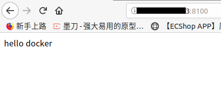

#### 下载镜像
通过最简单的 image 文件"hello world"，感受一下 Docker。
需要说明的是，国内连接 Docker 的官方仓库很慢，还会断线，需要将默认仓库改成国内的镜像网站，具体的修改方法在第一节。有需要的朋友，可以先看一下,配置完记得重启一下docker。
首先，运行下面的命令，将 image 文件从仓库抓取到本地
`docker image pull library/hello-world`
- 解释:
	- `docker image pull`是抓取image文件的命令
	- `library/hello-world`是image文件在仓库的位置，其中library是文件所在的组，hello-world是image文件的名字
由于Docker官方提供的image文件，都放在library组里面，所以它是默认组，可以省略，如下：
`docker image pull hello-world`

抓取成功以后，就可以在本机看到这个 image 文件了
`docker image ls`
运行这个image文件
`docker container run hello-world`
- 解释：
	- `docker container run`命令会从image文件，生成一个正在运行的容器实例
	  `docker container run`命令具有自动抓取image文件的功能，如果发现本地没有指定的image文件，就会从仓库自动抓取，
	  因此，前面的`docker run pull`命令并不是必须的步骤

运行成功，会出现如下信息
```
$ docker container run hello-world

Hello from Docker!
This message shows that your installation appears to be working correctly.
```
出现上面信息后容器就会停止运行

有些容器不会自动终止，因为提供的是服务。比如，安装运行 Ubuntu 的 image，就可以在命令行体验 Ubuntu 系统
`docker container run -it ubuntu bash`

对于不会自动终止的容器，必须使用`docker container kill`命令来手动终止
`docker container kill [containID]`

##### 容器文件
image文件生成的容器实例，本身也是一个文件，称为容器文件。也就是说，一旦容器生成，就会同时存在两个文件 image 文件和容器文件
而且关闭容器并不会删除容器文件，只是容器停止运行而已
```shell
# 列出本机正在运行的容器
docker container ls

# 列出本机所有容器，包括终止运行的容器
docker container ls --all
```


#### 创建镜像

- 1.新建一个目录和一个Dockerfile文件
我是在`/home`新建的
```shell
mkdir dockerProjects
cd dockerProjects
touch Dockerfile
```
- 2.Dockerfile 中每一条指令都创建镜像的一层，示例:
```shell
# 该image文件继承官方的 python image，冒号表示标签，这里标签是3.7，即3.7版本的python
FROM python:3.7-slim
# 指定接下来的工作路径为/app
WORKDIR /app
# 将当前目录内容复制到/app的容器中
ADD . /app
# 在/app目录下，运行pip install命令安装requirements.txt中环境包。注意，安装后所有的环境包，都将打包进入image文件
RUN pip install -i https://pypi.douban.com/simple -r requirements.txt
# 将容器 80 端口暴露出来，允许外部连接这个端口
EXPOSE 80
# 定义环境变量
ENV NAME world
# 容器启动时运行app.py
CMD ["python","app.py"] 
```
### 注意以上配置文件，不要用单引号
- 3.创建`app.py`
`vim app.py`
编辑
```pyhton
# 导入flask
from flask import Flask

# 获取方式对象，(就随意)命名为app
app = Flask(__name__)
# 使用app绑定路由
@app.route('/')
def hello():
    # 页面内容
    return 'hello docker'

# 启动
if __name__ == '__main__':
    app.run(host='0.0.0.0',port=80)
```
- 4.创建`requirements.txt`文件并加入需要的环境包(示例为:Flask)
- 5.生成image镜像
`docker image build -t hello:v-1.0 .`或 `docker build -t hello:v-1.0`
`-t`参数用来指定image文件的名字，后面还可以用冒号指定标签，如果不指定，默认的标签就是latest。最后的那个点表示 Dockerfile 文件所在的路径，上例是当前路径，所以是一个点。

运行成功后就生成了image镜像文件了
`docker images`查看

- 6.生成容器
`docker container run`命令会从image文件生成容器（container 可省略）
```shell
docker run -p 8100:80 hello:v-1.0
# 或
docker container run -p 8100:80 -it hello /bin/bash  # 用于没有设置tag时
# 或者
docker container run -p 8100:80 -it hello:v-1.0 /bin/bash
# 也可以这样
docker container run --rm --name hello -d -p 8100:80 hello:v-1.0
```
`-p`参数：容器的80端口映射到本机的8100端口，外界通过8100端口访问
`-it`参数：容器的Shell映射到当前的Shell，然后你在本机窗口输入的命令，就会传入容器
`hello:v-1.0`：image文件的名字（如果有标签，还需要提供标签，默认是latest标签）
`/bin/bash`：容器启动以后，内部第一个执行的命令。这里是启动Bash，保证用户可以使用Shell

`-d`：表示容器在后台运行（不产生输出到Shell）并显示容器的ID
`--rm`：表示容器停止后自动删除容器
查看正在运行中的容器
`docker ps`
- 访问(外部通过ip:8100访问上面的flask程序)


