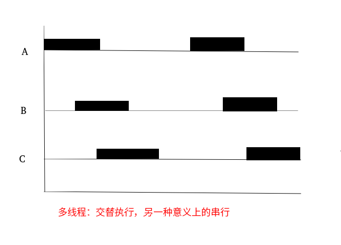

###  并发编程浅谈(一)
**Python实现并发编程**
- 多线程
- 多进程
- 协程(生成器)
##### 并发编程的基本概念
- 串行：一个人在一段时间段内只能干一件事情（吃完饭后才能看电视）
- 并行：一个人在一段时间内同时干多件事情（边吃饭边看电视）

在Python中，多线程 和 协程 虽然是严格上来说是串行，但却比一般的串行程序执行效率高得很。
一般的串行程序，在程序阻塞的时候，只能干等着，不能去做其他事。就好像，电视上播完正剧，进入广告时间，我们却不能去趁广告时间是吃个饭。对于程序来说，这样做显然是效率极低的，是不合理的。

当然，利用广告时间去做其他事，灵活安排时间。这也是我们多线程和协程 要帮我们要完成的事情，内部合理调度任务，使得程序效率最大化。

虽然 多线程 和 协程 已经相当智能了。但还是不够高效，最高效的应该是一心多用，边看电视边吃饭边聊天。这就是我们的 多进程 才能做的事了。




##### 单线程、多线程、多进程对比

**实验配置**

操作系统 | cpu核数 | 内存 | 硬盘
------ | ------ | ------| ------ 
ubuntu 18.04 | 4 | 8G | SSD
**开始对比之前定义四种类型的场景**
- CPU计算密集型
	- 一些进程绝大多数时间在计算上，称为计算密集型（CPU密集型）computer-bound。一些大量循环的代码（例如：图片处理、视频编码、人工智能等）就是CPU密集型
- 磁盘IO密集
	- 磁盘io，顾名思义就是磁盘的输入输出。即向磁盘写入数据和从磁盘读取数据
- 网络IO密集
	- 有一些进程则在input 和output上花费了大多时间，称为I/O密集型，I/O-bound。比如搜索引擎大多时间是在等待相应
-【模拟】IO密集
```python
import time
import requests

# CPU计算密集型
def cpu_count(a=1,b=1):
    # 使程序完成150万次计算
    c = 0
    while c < 500000:
        c += 1
        a += a
        b += b

# 磁盘读写IO密集
def io_disk():
    with open('./IOtest.txt','w') as f:
        for i in range(5000000):
            f.write('磁盘-io-测试')
            
# 网络IO密集型
headers = {
        "User-Agent": "Mozilla/4.0 (compatible; MSIE 7.0; Windows NT 5.1; 360SE)"
    }
url = 'https://www.baidu.com/'
def io_request():
    try:
        response = requests.get(url,headers=headers)
        return
    except Except as e:
        return e

# 模拟IO密集
def io_simulation():
    time.sleep()
```
> 比拼的指标，用时间来衡量。时间消耗得越少，说明效率越高
```python
#import functools import wraps
# 定义一个时间装饰器，来计算消耗的时间
def record(output):
    def use_time(func):
        @wraps(func)
        def wrapper(*args,**kwargs):
            type = kwargs.setdefault('type',None)
            st_time = time.time()
            result = func(*args,**kwargs)
            end_time = time.time()
            print(f'{output}-{type}耗时：{end_time-st_time}s')
        return wrapper
    return use_time
```
**1.先来看看单线程**
```python
# 定义单线程
@record('【单线程】')
def single_thread(func,type=''):
    for i in range(10):
        func()
        
# 开始测试【单线程】
single_thread(cpu_count,type='CPU计算密集型')
single_thread(io_disk,type='磁盘IO密集型')
single_thread(io_request,type='网络IO密集型')
single_thread(io_simulation,type='模拟IO密集型')

# 结果
【单线程】-CPU计算密集型耗时：80.91554880142212s
【单线程】-磁盘IO密集型耗时：15.750258445739746s
【单线程】-网络IO密集型耗时：2.640401840209961s
【单线程】-模拟IO密集型耗时：20.018026113510132s
```
**2.再来看看多线程**
```python
from threading import Thread

# 写法一
@record('【多线程】')
def multi_thread(func,type=''):
    threads = [Thread(target=func) for _ in range(10)]
    for thread in threads:
        thread.start()
    for thread in threads:
        thread.join()

# 多线程测试1
multi_thread(cpu_count,type='CPU计算密集型')
multi_thread(io_disk,type='磁盘IO密集型')
multi_thread(io_request,type='网络IO密集型')
multi_thread(io_simulation,type='模拟IO密集型')

# 结果
【多线程】-CPU计算密集型耗时：121.99781441688538s
【多线程】-磁盘IO密集型耗时：21.91859245300293s
【多线程】-网络IO密集型耗时：0.4386627674102783s
【多线程】-模拟IO密集型耗时：2.0033113956451416s

# 写法二(要慢一点)
@record('【多线程】')
def mul_thread(func,type=''):
    thread_list = []
    for i in range(10):
        t = Thread(target=func,args=())
        thread_list.append(t)
        t.start()
    e = len(thread_list)
    while True:
        for th in thread_list:
            if not th.is_alive():
                e -= 1
        if e <= 0:
            break

# 多线程测试2
mul_thread(cpu_count,type='CPU计算密集型')
mul_thread(io_disk,type='磁盘IO密集型')
mul_thread(io_request,type='网络IO密集型')
mul_thread(io_simulation,type='模拟IO密集型')

# 结果
【多线程】-CPU计算密集型耗时：126.94713139533997s
【多线程】-磁盘IO密集型耗时：37.09427046775818s
【多线程】-网络IO密集型耗时：0.6191723346710205s
【多线程】-模拟IO密集型耗时：2.0074384212493896s
```
**3.最后来看看多进程吧**
```python
from multiprocessing import Process

# 写法一
@record('【多进程】')
def multi_process(func,type=''):
    processes = [Process(target=func) for _ in range(10)]
    for process in processes:
        process.start()
    for process in processes:
        process.join()

# 多进程测试１
multi_process(cpu_count,type='CPU计算密集型')
multi_process(io_disk,type='磁盘IO密集型')
multi_process(io_request,type='网络IO密集型')
multi_process(io_simulation,type='模拟IO密集型')

# 结果
【多进程】-CPU计算密集型耗时：44.23211455345154s
【多进程】-磁盘IO密集型耗时：7.884604215621948s
【多进程】-网络IO密集型耗时：0.40494322776794434s
【多进程】-模拟IO密集型耗时：2.064232349395752s

# 写法二(还是要慢一点)
@record('【多线程】')
def mul_process(func,type=''):
    process_list = []
    for i in range(10):
        p = Process(target=func,args=())
        process_list.append(p)
        p.start()
    e = len(process_list)
    while True:
        for p in process_list:
            if not p.is_alive():
                e -= 1
        if e <= 0:
            break

# 多进程测试２
mul_process(cpu_count,type='CPU计算密集型')
mul_process(io_disk,type='磁盘IO密集型')
mul_process(io_request,type='网络IO密集型')
mul_process(io_simulation,type='模拟IO密集型')

# 结果
【多进程】-CPU计算密集型耗时：47.9653902053833s
【多进程】-磁盘IO密集型耗时：9.239834308624268s
【多进程】-网络IO密集型耗时：0.31076598167419434s
【多进程】-模拟IO密集型耗时：2.0489490032196045s
```
#####  性能对比汇总
类型 | cpu计算密集型 | 磁盘IO密集型 | 网络IO密集型 | 模拟IO密集型
------ | ------ | ------| ------ | ------
单线程 |89.91 | 15.75 | 2.64 | 20.01
多线程测试一 |121.99 | 21.91 | 0.43 | 2.00
多线程测试二 |126.94 | 37.09 | 0.61 | 2.00
多进程测试一 | 44.23 | 7.88 |0.40 | 2.06
多线程测试二 | 47.96 | 9.23 | 0.31 | 2.04

>分析下这个表格

首先是CPU密集型，多线程以对比单线程，不仅没有优势，显然还由于要不断的加锁释放GIL全局锁，切换线程而耗费大量时间，效率低下，而多进程，由于是多个CPU同时进行计算工作，相当于十个人做一个人的作业，显然效率是成倍增长的。

然后是IO密集型，IO密集型可以是磁盘IO，网络IO，数据库IO等，都属于同一类，计算量很小，主要是IO等待时间的浪费。通过观察，可以发现，我们磁盘IO，网络IO的数据，多线程对比单线程也没体现出很大的优势来。这是由于我们程序的的IO任务不够繁重，所以优势不够明显。

所以我还加了一个「模拟IO密集型」，用sleep来模拟IO等待时间，就是为了体现出多线程的优势，也能让大家更加直观的理解多线程的工作过程。单线程需要每个线程都要sleep(2)，10个线程就是20s，而多线程，在sleep(2)的时候，会切换到其他线程，使得10个线程同时sleep(2)，最终10个线程也就只有2s.

可以得出以下几点结论
>单线程总是最慢的，多进程总是最快的。
多线程适合在IO密集场景下使用，譬如爬虫，网站开发等
多进程适合在对CPU计算运算要求较高的场景下使用，譬如大数据分析，机器学习等
多进程虽然总是最快的，但是不一定是最优的选择，因为它需要CPU资源支持下才能体现优势
